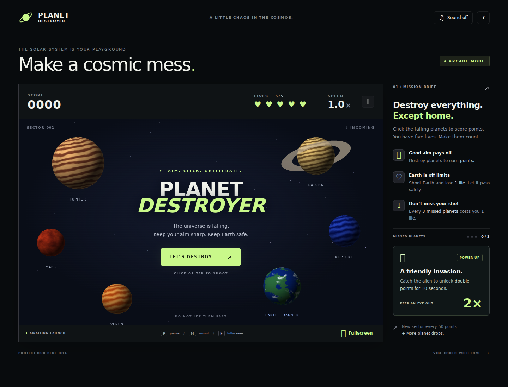

# Planet Destroyer

A browser arcade game built with Three.js. Click or tap falling planets, dodge Earth, and catch aliens for a temporary score boost as the action speeds up.


[](https://jesuspinar.com/planet-destroyer/)

## How to play

1. Select **LET’S DESTROY** to start with five lives.
2. Click or tap target planets to earn points. Let Earth pass safely.
3. Shoot an alien to activate **double points for 10 seconds**. Another alien refreshes the timer.
4. Keep up as each new sector increases the speed and frequency of planet drops.

Shooting Earth costs one life, clears the double-points bonus, and resets the missed-planet counter. Every three missed target planets also costs one life. Earth and aliens can pass without penalty. The game ends when you run out of lives.

### Controls

| Input | Action |
| --- | --- |
| Click / tap | Shoot a planet or alien |
| `P` / pause button | Pause or resume |
| `M` / sound button | Toggle sound |
| `F` / Fullscreen button | Toggle fullscreen |
| `?` button | Open the flight manual |

## Run locally

Use **Node.js 22.12+ or 24+** and npm, plus a modern browser with WebGL support. The included Nix development shell provides Node.js 24.

```bash
git clone https://github.com/jesuspinar/planet-destroyer.git
cd planet-destroyer
npm ci
npm run dev
```

Open the local URL printed by Vite, usually `http://localhost:5173`.

If you use Nix flakes, run `nix develop` before the npm commands.

## Development commands

| Command | Purpose |
| --- | --- |
| `npm run dev` | Start the Vite development server |
| `npm test` | Run game-logic tests with Node’s built-in test runner |
| `npm run build` | Create the production website in `dist/` |
| `npm run preview` | Serve the production build locally after building |

**Current test limitation:** `npm test` imports `dist/game-core.js`, which the Vite build does not emit as a standalone file. The tests also contain older scoring expectations. They need updating before the test suite can pass against the current source.

## Project structure

| Path | Purpose |
| --- | --- |
| `src/index.html` | Page layout, game HUD, and help dialog |
| `src/style.css` | Website styling and responsive layouts |
| `src/game.js` | Three.js rendering, input, audio, and game loop |
| `src/game-core.js` | Scoring, lives, bonuses, and progression rules |
| `tests/game-core.test.js` | Game-logic tests |
| `vite.config.js` | Vite configuration and production output |
| `.github/workflows/deploy.yml` | GitHub Pages build and deployment workflow |
| `docs/images/planet-destroyer.png` | Website screenshot used in this README |
